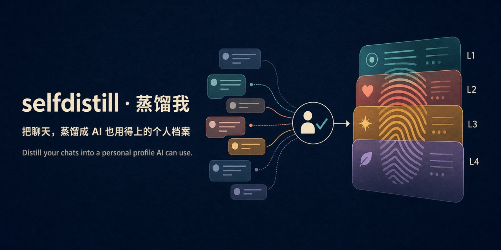

# selfdistill · Distill Yourself

English | [中文](README.md)



Distill your chat history with AI — with **AI assistance + human confirmation** — into a **visible, sourced, AI-usable** personal profile, then write it back to the AI tools you use so they keep knowing you.

> Data stays on your machine by default; the "distillation" step calls a cloud AI, so anything you submit to the model is subject to that provider's data policy.

> **[Live HTML Demo →](https://ryunana.github.io/selfdistill/)**
>
> No install needed; all sample content is fictional. Browse the L1–L4 layered architecture, content distribution, design principles, and collaboration flow (the demo supports 中文 / EN switching).

## Table of Contents

- [What Is This](#what-is-this)
- [Data Flow](#data-flow)
- [Repository Structure](#repository-structure)
- [Quick Start](#quick-start)
- [First Distillation: Build L1–L4 from Full History](#first-distillation-build-l1l4-from-full-history)
- [Import Sources](#import-sources)
- [Outputs & Write-back Targets](#outputs--write-back-targets)
- [Keep Your Profile Up to Date](#keep-your-profile-up-to-date)
- [Work Evidence: Organize Project Facts, Don't Auto-Package Outcomes](#work-evidence-organize-project-facts-dont-auto-package-outcomes)
- [Privacy & Security](#privacy--security)
- [Dependencies](#dependencies)

## What Is This

selfdistill is an "AI self-distillation" toolkit: it takes your chat history from tools like ChatGPT / Claude / Codex / Gemini and distills it into L1–L4 structured information, then writes it back to AI tools (Codex / Hermes / DeepSeek Harness / WorkBuddy):

| Level | Content | In plain words | How AI tools load it |
|-------|---------|----------------|----------------------|
| L1 Collaboration Contract | Authorization boundaries, reporting habits, feedback signals, expression preferences | "How to work with me" | **Always loaded**: applies to every conversation (short, non-sensitive) |
| L2 Decision Logic | Trade-off principles, priorities, red lines | "How I make decisions" | **On demand**: when weighing trade-offs, prioritising, or judging risk |
| L3 Personal Facts | Identity, experiences, preferences | "Who I am" | **On demand**: when personal background matters; private blocks are not loaded by default |
| L4 Domain Playbooks | Reusable working methods | "What I'm good at and how" | **On demand**: when a matching domain task comes up |

Design principle: **the always-on content stays thinnest (L1), and the lower layers get heavier and more on-demand**; L3 only provides facts and default preferences and can never issue behavior commands; the user's current explicit request always outranks the historical profile.

Two outputs: ① a local multi-page HTML visualization; ② incremental write-back to your AI tools after confirmation (so AI keeps knowing you). The repo also provides an independent work-evidence entry point: it helps verify project contributions but never automatically enters L4, a resume, or the canonical profile.

## Data Flow

```text
Export chat history → Normalize into unified Markdown → AI distills L1–L4 candidates → Confirm each item with the user → Write to workspace/canonical/ → Build HTML / write back to AI tools
```

"Human confirmation" is a hard rule throughout: **nothing is written to the canonical profile without confirmation, and write-back always shows a diff first.**

## Repository Structure

| Directory | Purpose |
|-----------|---------|
| [`workspace/`](workspace/) | Your local workspace: confirmed profile, imported chats, candidates, and audit reports; real content is git-ignored |
| [`examples/demo-profile/`](examples/demo-profile/) | The public fictional “Zhang San” demo, used for previews and empty-workspace builds |
| [`templates/profile/`](templates/profile/) | Blank L1–L4 starter templates |
| [`prompts/`](prompts/) / [`schemas/`](schemas/) | AI distillation rules and machine-readable contracts |
| [`docs/`](docs/) | Import and continuous-update guides; early development records are archived separately |
| [`dsh/`](dsh/) / [`workbuddy/`](workbuddy/) | Platform integration packages; root paths remain stable for existing install links |
| [`tests/`](tests/) | Automated regression tests |

## Quick Start

You only need to do two things: **① export your chat history → ② send the project link and the export location to your AI assistant in one sentence**. Everything after — organizing, distilling, proposing candidates, building, writing back — is handled by the AI assistant; you only review and confirm the results at the end.

### What you do

1. Export your chat history from the relevant AI tool per [Import Sources](#import-sources), and note where the export files are on your machine.
2. Send the project link to the AI you're using (Codex, Claude Code, Hermes, DeepSeek Harness, or WorkBuddy, etc.) and say in one sentence:

   ```text
   Distill me with this project: https://github.com/ryunana/selfdistill
   My chat history export is at: <path-to-export-on-your-machine>
   ```

   The AI assistant will clone the project, read the handoff instructions (`AGENTS.md`), import your records, and propose L1–L4 candidates on its own.
3. Review the candidates and confirm, edit, or reject each one. Confirm the diff once more before any write-back.

> DeepSeek Harness and WorkBuddy users can [install the selfdistill plugin](#install-the-selfdistill-plugin-optional) so the agent knows this workflow natively — no need to send the link note above every time.

### What the AI assistant does (automatic, no effort from you)

After cloning the project, the AI assistant auto-reads the root `AGENTS.md` handoff instructions and follows them: import → propose candidates → confirm item by item → write `workspace/canonical/` → build → write back. See `AGENTS.md` and `prompts/distill.md` for the full flow.

Manual step-by-step instructions (without an AI assistant) are in the sections below.

## First Distillation: Build L1–L4 from Full History

First normalize the authorized chats into unified Markdown per [`docs/intake.md`](docs/intake.md), then use [`prompts/distill.md`](prompts/distill.md). The AI must read everything and report scope, evidence, conflicts, recency, and unread content, and only propose candidates without touching the canonical profile.

L3 is always confirmed item by item; personal content in L1/L2/L4, as well as sensitive, high-risk, disputed, or conflicting content, is also confirmed item by item. Only general rules that are unrelated to the person, low-risk, non-sensitive, undisputed, and conflict-free may skip per-item confirmation; they must still be individually visible and reversible, recorded as `policy_accepted_general` — never treated as per-item user acceptance. No matter how a candidate passed, a final explicit aggregate-diff confirmation is always required before actually writing files.

[`templates/distill-candidates.md`](templates/distill-candidates.md) is the human review sheet; [`schemas/distill-candidate-v1.json`](schemas/distill-candidate-v1.json) is the same field contract for future automation. Ordinary users don't need to hand-write JSON.

## Import Sources

**Auto importer** (recommended): feed export files to `import_chats.py`; local sessions are discovered automatically (dry-run list first, then confirmed writes):

```bash
python3 import_chats.py --source chatgpt  --path <export dir>
python3 import_chats.py --source gemini   --path <Takeout dir>
python3 import_chats.py --source deepseek --path <conversations.json or zip>
python3 import_chats.py --source local [--since YYYY-MM-DD] [--exclude glob] [--dry-run]
# when local --path contains mixed JSONL files:
python3 import_chats.py --source local --path <directory> --local-format auto|codex|claude|workbuddy --dry-run
```

The importer writes each Gemini `Prompted` activity separately. ChatGPT follows the active path when `current_node` is valid; it preserves and splits validated root-to-leaf branches only when the field is absent or `null`. A present malformed reference or reference to a missing node fails closed and is reported. DeepSeek branches are separate conversations rather than one invented merge. Images and authorized attachments become readable placeholders; model thinking, tool traces, and known local internal injections stay out of Markdown. `--dry-run` fully parses and reports planned new, updated, duplicate, and failed items without creating files. Exit code `0` means success (including expected internal exclusions), `2` partial success, and `1` fatal or all-failed input.

| Source | Export entry (quick reference) | Auto import |
|--------|-------------------------------|-------------|
| ChatGPT web | Avatar (bottom-left) → Settings → **Data management** → Export data; unzip to get `conversations-*.json` | `--source chatgpt` |
| Gemini web ⚗️ | Google Takeout → My Activity → **Gemini Apps** → Export; unzip to get `我的活动记录.html` | `--source gemini` (one conversation per Prompted activity; stops for unreliable activity containers) |
| DeepSeek web | Avatar (bottom-left) → **System settings** → **Data management** → **Export all chat history** | `--source deepseek` |
| Local Codex / Claude Code | Sessions live in `~/.codex/sessions`, `~/.claude/projects` | `--source local` (auto-discovery) |
| Local WorkBuddy | Sessions live in `~/.workbuddy/projects/<workspace>/<sessionId>.jsonl`; subagent sessions (`subagents/`) are excluded automatically | `--source local --local-format workbuddy` (scans that dir by default without `--path`) |

Full format details and the manual fallback live in [docs/intake.md](docs/intake.md).

## Outputs & Write-back Targets

### ① HTML visualization

```bash
python3 build.py          # reads workspace/ when populated; otherwise builds the fictional demo
open dist/index.html      # L1–L4 architecture, content distribution, principles, collaboration flow (中 / EN switchable)
```

If the build reports that it is using the fictional demo, `dist/` is preview-only and `install.py` refuses write-back. Create your confirmed profile under `workspace/canonical/`, then rebuild.

### ② Write back to AI tools (so AI keeps knowing you)

| Target | Where it goes | Command | How it loads |
|--------|---------------|---------|--------------|
| Codex | `~/.codex` (AGENTS.md + profile/ + skills/) | `python3 install.py --target codex` | Codex reads AGENTS.md automatically; the rest on demand |
| Hermes | `~/.hermes/skills/` | `python3 install.py --target hermes` | Hermes skill mechanism, loaded on demand |
| DeepSeek Harness | `$DSH_HOME` (default `~/.dsh`) | `python3 install.py --target dsh` | persona always carries L1; L2/L3/L4 are on-demand skills |
| WorkBuddy | `~/.workbuddy` (MEMORY.md + skills/) | `python3 install.py --target workbuddy` | L1 merged into MEMORY.md, resident every session; L2/L3/L4 are on-demand skills |

Every write-back **shows a diff first and writes only after confirmation**; re-installs merge incrementally and never overwrite unrelated content.

#### Privacy levels when writing back to WorkBuddy

| Content | Where it goes | When it loads |
|---------|---------------|---------------|
| L1 Collaboration Contract | `~/.workbuddy/MEMORY.md` (user-level memory, distill-marked block) | Loaded in every new session (short, non-sensitive) |
| L2 Decision Logic | `~/.workbuddy/skills/selfdistill-decision-logic/SKILL.md` | On demand |
| L3 Personal Facts | `~/.workbuddy/skills/selfdistill-user-profile/SKILL.md` | On demand; private L3 not written by default (`--include-private` to include) |
| L4 Domain Playbooks | `~/.workbuddy/skills/selfdistill-<domain>/SKILL.md` | On demand |

#### Privacy levels when writing back to DeepSeek Harness

| Content | Where it goes | When it loads |
|---------|---------------|---------------|
| L1 Collaboration Contract | `system-prompt.persona` (`$DSH_HOME/cordis.patch.yml`) | Loaded in every new conversation (short, non-sensitive) |
| L2 Decision Logic | `~/.dsh/skills/selfdistill-decision-logic/SKILL.md` | On demand |
| L3 Personal Facts | `~/.dsh/skills/selfdistill-user-profile/SKILL.md` | On demand; private L3 not written by default (`--include-private` to include) |
| L4 Domain Playbooks | `~/.dsh/skills/selfdistill-<domain>/SKILL.md` | On demand |

#### Install the selfdistill plugin (optional)

Write-back installs your *profile* into an AI tool; the plugin instead teaches the agent the selfdistill *workflow* (organize → distill → confirm → build → write back), so the whole process can run inside that tool:

**WorkBuddy** (copy the `selfdistill` skill into the user-level skill directory):

```bash
mkdir -p ~/.workbuddy/skills && cp -r workbuddy/skills/selfdistill ~/.workbuddy/skills/
# restart WorkBuddy to activate; then just say "distill me with selfdistill"
```

**DeepSeek Harness**:

```bash
dsh plugin --profile web add "github:ryunana/selfdistill#main&path:/dsh"
# restart dsh web to activate
```

- The DSH plugin is a zero-dependency bundle (`selfdistill-dsh`); after install, a `selfdistill` skill appears in the agent's skill catalog;
- Once published to npm: `dsh plugin --profile web add selfdistill-dsh`.

## Keep Your Profile Up to Date

After the first distillation, you do not need to start over each time:

- **A new batch of chats**: import it with `import_chats.py`, then use `prompts/distill.md` to extract new candidates;
- **A few day-to-day corrections**: use the lighter audit flow built around `workspace/inbox/`, `distill_audit.py`, and `prompts/rediscovery.md`.

See the [continuous-update guide](docs/continuous-update.en.md) for the full steps and boundaries. Either way, review the candidates and explicitly confirm the final aggregate diff before anything is written to `workspace/canonical/`.

## Work Evidence: Organize Project Facts, Don't Auto-Package Outcomes

Hand the user-authorized project materials to [`prompts/work-evidence.md`](prompts/work-evidence.md). It separates project background, goals, responsibilities, actions, deliverables, results, metrics, sources, and evidence gaps, and strictly distinguishes participated, responsible, led, and decision-ownership. Metrics must keep their statistical basis, time window, baseline, and source; leave gaps empty rather than fabricating numbers, causality, responsibilities, or project status.

Work evidence is an independent, optional review material: every personal contribution needs per-item confirmation, there are no general rules that skip review, and nothing auto-enters a resume, L4, or `workspace/canonical/`. [`templates/work-evidence.md`](templates/work-evidence.md) is for human review; [`schemas/work-evidence-v1.json`](schemas/work-evidence-v1.json) is for future automation; ordinary users need no hand-written JSON. If files are ever written later, still show and explicitly confirm the aggregate diff first.

## Privacy & Security

- `workspace/canonical/`, `workspace/input/`, `workspace/inbox/`, `workspace/reports/`, and `dist/` are local data or build artifacts, git-ignored by default; the repo keeps only directory instructions and placeholders. **Never commit real profiles, chats, candidates, or reports to a public repository.**
- Data stays local by default; if you hand `evidence.md` to a cloud AI, that provider's data policy applies.
- Private L3 (`workspace/canonical/03-l3-private.md`) is not built or written back by default; use `python3 build.py --include-private` when needed.
- Every write-back shows a diff and requires confirmation; re-installs merge incrementally and refuse to overwrite files not managed by selfdistill.

## Dependencies

Pure Python standard library, no third-party dependencies (Python 3.9+).

## Pre-release Check

```bash
python3 scripts/scan_before_release.py
```
This script only scans the current working tree, not Git history; before any public release, also confirm the history contains no personal data or local identity.

## License

MIT
